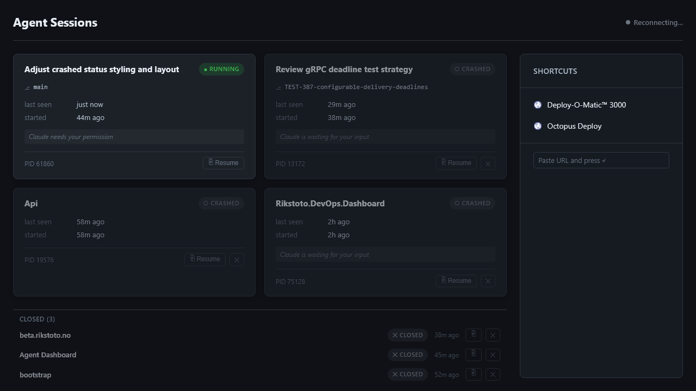

# Agent Session Dashboard

Live-updating web dashboard showing all active Claude Code sessions on your machine in real time.



---

## Prerequisites

- [Docker Desktop](https://www.docker.com/products/docker-desktop/) (or Docker + Compose)
- [PowerShell 7+](https://github.com/PowerShell/PowerShell/releases) (`pwsh`)
- Claude Code CLI

---

## 1. Start the Dashboard

```powershell
docker compose up -d
```

Dashboard runs at **http://localhost:5900**. SQLite data persists in a Docker volume across restarts.

To update after pulling changes:

```powershell
docker compose up -d --build
```

---

## 2. Install the Hooks

The hooks script posts session events from every Claude Code session to the dashboard backend.

**Run once from the repo root:**

```powershell
pwsh -File hooks/install.ps1
```

This will:
- Copy `hooks/session-reporter.ps1` → `~/.claude/hooks/session-reporter.ps1`
- Patch `hooks` into each Claude account's `settings.json` (`~/.claude-aurum/` and `~/.claude-gmail/`)

> **Restart Claude Code** after installing for hooks to take effect.

### What the install script patches

The installer writes these hook events into each account's `settings.json`:

| Hook | Event sent | Purpose |
|---|---|---|
| `SessionStart` | `started` | Register new session |
| `SessionEnd` | `closed` | Mark session closed |
| `PostToolUse` | `heartbeat` | Keep session alive (throttled 10s) |
| `Stop` | `heartbeat` | Heartbeat after agent turn |
| `SubagentStart` | `subagent-start` | Track subagent activity |
| `SubagentStop` | `heartbeat` | Heartbeat after subagent |
| `Notification` | `notification` | Surface last Claude message |
| `WorktreeCreate` | `worktree-create` | Track active worktree |
| `WorktreeRemove` | `worktree-remove` | Clear worktree on removal |

### Manual hook install (single account)

If you only have one Claude config or want to wire it yourself, add the following to `~/.claude/settings.json` (adjust the path if needed):

```json
{
  "hooks": {
    "SessionStart": [{ "hooks": [{ "type": "command", "command": "pwsh -NonInteractive -File \"~/.claude/hooks/session-reporter.ps1\" -Event started" }] }],
    "SessionEnd":   [{ "hooks": [{ "type": "command", "command": "pwsh -NonInteractive -File \"~/.claude/hooks/session-reporter.ps1\" -Event closed" }] }],
    "PostToolUse":  [{ "matcher": "", "hooks": [{ "type": "command", "command": "pwsh -NonInteractive -File \"~/.claude/hooks/session-reporter.ps1\" -Event heartbeat" }] }],
    "Stop":         [{ "hooks": [{ "type": "command", "command": "pwsh -NonInteractive -File \"~/.claude/hooks/session-reporter.ps1\" -Event heartbeat" }] }],
    "SubagentStop": [{ "hooks": [{ "type": "command", "command": "pwsh -NonInteractive -File \"~/.claude/hooks/session-reporter.ps1\" -Event heartbeat" }] }]
  }
}
```

---

## 3. Verify It Works

1. Open **http://localhost:5900**
2. Start (or use) any Claude Code session
3. A session card should appear within seconds

The `● Live` indicator in the top-right confirms the SSE stream is connected. If it shows `Reconnecting...`, the backend isn't reachable — check `docker compose ps` and `docker compose logs`.

---

## Session Statuses

| Status | Meaning |
|---|---|
| `running` | Heartbeat received in the last 30s |
| `idle` | No heartbeat for >30s, session still open |
| `closed` | `SessionEnd` hook fired cleanly |
| `crashed` | No `SessionEnd` + PID no longer exists |

---

## Local Development (without Docker)

```powershell
# Terminal 1 — backend (.NET 10 SDK required)
cd backend/AgentSessionDashboard
dotnet run

# Terminal 2 — frontend (Node 22+ required)
cd frontend
npm install
npx ng serve --proxy-config proxy.conf.json
```

Frontend dev server: **http://localhost:4200** (proxies `/api` to the backend on port 5000).

Build the frontend into the backend's `wwwroot` (same as Docker does):

```powershell
cd frontend
npm run build
```

---

## Environment Variables

| Variable | Default | Description |
|---|---|---|
| `DB_PATH` | `/data/sessions.db` | SQLite database path inside the container |

---

## Architecture

```
Claude Code (any session)
  └── Global hooks (~/.claude/settings.json)
        └── ~/.claude/hooks/session-reporter.ps1
              └── HTTP POST → localhost:5900/api/sessions/event

.NET 10 backend (ASP.NET Core)
  ├── POST /api/sessions/event   — receives hook payloads
  ├── GET  /api/sessions         — current session list (JSON)
  └── GET  /api/sessions/stream  — SSE stream of live updates

Angular 20 frontend
  └── Served as static files from .NET wwwroot (single container)
```

Single Docker container. One `docker-compose.yml`. SQLite on a named volume.

See [IMPLEMENTATION_PLAN.md](IMPLEMENTATION_PLAN.md) for full design detail.
